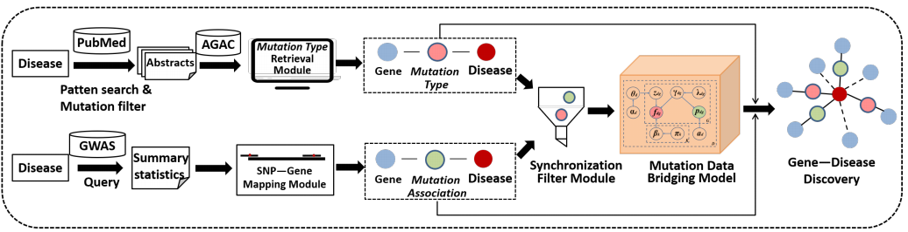

# Data Collection
The **MutationTypeData** folder contains all the abstracts (with json file type) that are downloaded from PubTator (https://www.ncbi.nlm.nih.gov/research/pubtator/). In the case when ones would like to collect all literature data related to an interested disease, please search the disease name in PubTator database and download all the json files. Subsequently, these json files need to be processed to BIO format, and the following python script works to convert all the json files into an all-in-one txt file. An example is located at **BERT_multi_task/data/BIO_example.txt**.

    python MutationTypeData/json2bio.py --input MutationTypeData/ --output BERT_multi_task/data/BIO_example.txt

The **MutationAssociationData** contains the GWAS summary data related to the intereseted disease. For the disease under consideration, GWAS summary data need to be collected from resources like GWAS Catalog (https://www.ebi.ac.uk/gwas/). Please be sure to include both SNP rs id and p-value in the file. An example with proper format is shown in **MutationAssociationData/GWASsummaryData_example.txt**. 

Prior to data fusion, the SNPs in this file need to be mapped to specific genes. As an efficient tool, **bedtools** (https://bedtools.readthedocs.io/en/latest/) is applied to map SNPs to the corresponding genes. Then, the mutation association value of a gene, $p_{dg}$, is assigned by the most highest p-value of a SNP corresponed to this gene. Please carefully prepare the output file following the format of **MutationAssociationData/sorted_IGAP.csv**.

# GDAMDB
GDAMDB is an abbreviation of "Gene-Disease Association prediction by Mutation Data Bridging". This is a pipeline with sevaral steps. Please follow the below directions to run the pipeline scripts.

## Extract mutation triples from PubMed: 
To extract mutation type fdg from a targeted text resource in terms of a specific disease d.  
**BERT_multi_task/** contains the Mutation Type Retireval Module, which is to extract mutation triples from PubMed.  

The input file is the BIO format file output from **json2bio.py**, **data/BIO_example.txt**. After runing the the Mutation Type Retireval Module, the result is outputed to **output/**, where there is an example output file **pubtator_Alzheimer'sdisease.txt** whith the format of *(GeneID LOF/GOF/COM/REG DiseaseMeshID)*.

*Note:   
LOF -- loss of function mutation;   
GOF -- gain of function mutation;   
COM -- complex, loss of function mutation and gain of function mutation;   
REG -- mutation without direction.  
In the subsequent data fusion process, only GOF mutations and LOF mutations are utilized.*  

**Usage:**  

    bash zky_run_join_multi.sh

 
## Synchronization Filter:  
To filter top n genes g which shows significance both in literature and GWAS research.   
**usage:**   

    python generate_IGAP.py [threshold] [use_p_norm] [norm_value] [file_name]   
    
**\[threshold]:** The threshold of p-value. The Gene with greater p-value of the threshold will be saved;  
**\[use_p_norm]:** True, p-value greater than threshold are assigned with 0.5;  
**\[norm_value]:** False, p-value unchange;  
**\[file_name]:** sorted_IGAP.csv ,the processed GWAS file.  
The output file is located in **data/sorted_IGAP.txt**

 
## Mutation Data Bridging: 
To bridge all pdg and fdg and predict new gene disease associations.   
**usage:**  

    python inference_fusion_vvv.py [initlambda] [threshold] [times] [filter_count] [rounders] [hidden_factors] [inputfile] [outputfolder] 

**\[initlambda]:** 240, the hyper-parameter;  
**\[threshold]:** 5e-8, The threshold of p-value;  
**\[times]:** 100, to record the result at round 100 in iteration;  
**\[filter_count]:** 80, freguency hyper-parameter, to ensure the stable output.
**\[rounders]:**  100, the number of the iteration rounds.  
**\[hidden_factors]:**  
**\[inputfile]:** data/sorted_IGAP.txt, the result file from Synchronization Filter.
**\[outputfolder]:** generate/IGAP_Wilcoxon/, the outputfolder.

*Feel free to leave us feedbacks, if you have any further questions.*
