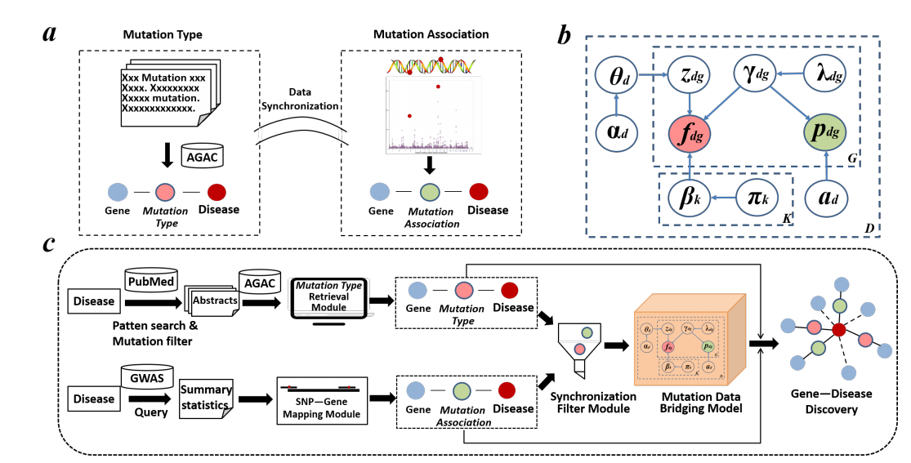

# GDAMDB
The purpose of this repository is to demonstrate the workflow of 
GDAMDB and NOT to implement it note to note and at the same time I will
 try not to miss out on the major bits discussed in the paper.
 For that matter, I'll be using the Flowers dataset.

## Extract mutation triples from PubMed articles: 
To extract mutation type fdg from a targeted text resource in terms of a specific disease d.
BERT_multi_task_/zky_run_join_multi.sh
 
## Synchronization Filter: 
To filter top n genes g which shows significance both in literature and GWAS research.
AGACGraphicalModel/generate_IGAP.py
 
## Mutation Data Bridging: 
To bridge all pdg and fdg and predict new gene disease associations.  
AGACGraphicalModel/inference_fusion_vvv.py

